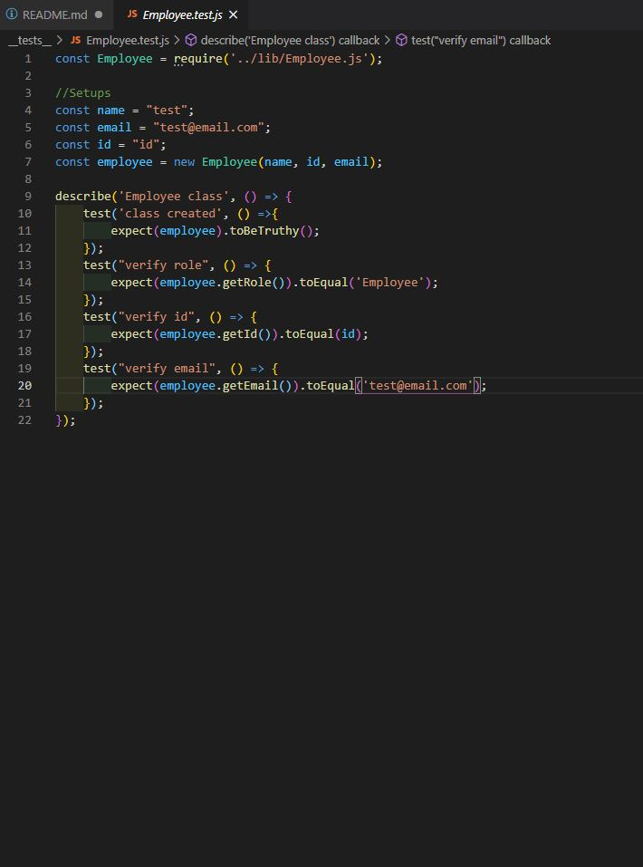

# TeamGenerator

### This assignment required us to make a node program to generate a html document dynamicly based off the node input.
We were also required to run jest verbose tests against our classes to insure data was being passed correctly.
Here is a link to my demo video including audio. 
[Demo Video](https://drive.google.com/file/d/15yYOaRuc9QUMK7pexYo2mciZG1-s31ID/view)
[Github Repo](https://github.com/JuStrait/TeamGenerator)

